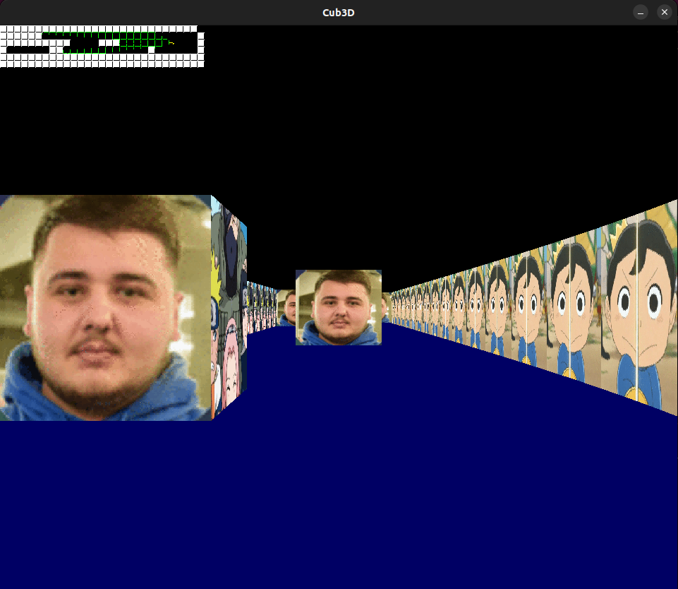
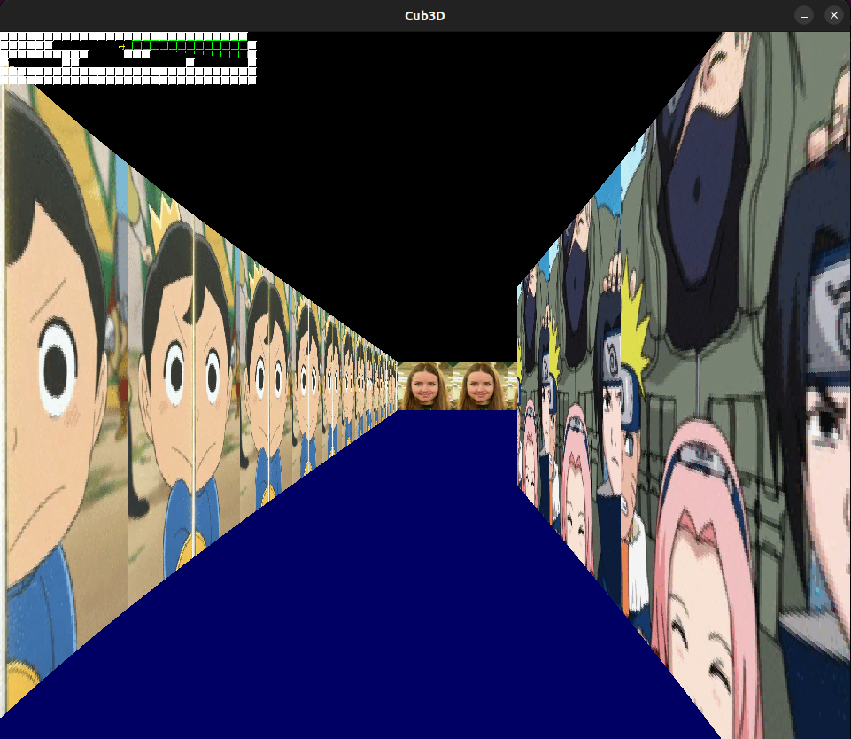

# Cub3D 🎮

## Description

Cub3D is a project that aims to create a 3D game using raycasting technique. The game is inspired by the world-famous Wolfenstein 3D game.

## Installation

```bash
make bonus
```

## How to run

```bash
./cub3D_bonus maps/map1.cub
```

## Screenshots




## License

[MIT](https://choosealicense.com/licenses/mit/)
